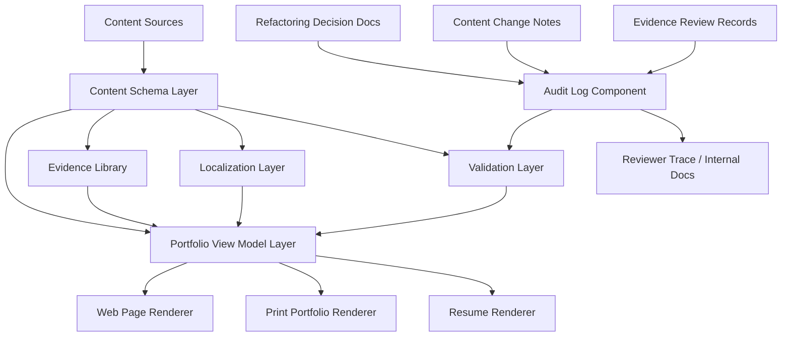

# Logical Architecture Proposal

## Purpose

This document proposes the logical architecture for refactoring the static portfolio site based on the validated requirements and Mob Elaboration decisions.

The portfolio should be treated as a static publishing system for company submission. It should organize professional positioning, evidence, case studies, research, resume content, and decision history into a coherent system.

No implementation details are prescribed here. This document defines components, responsibilities, and separation of concerns before code changes begin.

## Architecture Overview

## Architectural Principle

The site is static, but the content should not be treated as a loose collection of static pages.

The portfolio should operate as a structured evidence system:

- content sources hold raw professional material
- schema rules define meaning and required metadata
- evidence library organizes projects and research by professional themes
- view models prepare page-specific structures
- renderers produce web, print, and resume outputs
- validation prevents incomplete or unsafe content from being published
- audit logs preserve the reasoning behind portfolio decisions

## Component 1: Content Sources

### Responsibility

Content Sources store the raw material used across the site.

This component includes:

- project documents
- research and publication documents
- profile data
- experience data
- education data
- recognition data
- page-level copy
- resume content
- portfolio-specific copy

### Key Principle

Content should first exist as structured evidence, not as page-only prose.

This allows current projects and future projects, including new repositories such as CaracalDB, to be evaluated and rendered through the same system.

## Component 2: Content Schema Layer

### Responsibility

The Content Schema Layer defines the meaning, required fields, and allowed values for portfolio content.

It should make professional evidence explicit and consistent.

### Required Concepts

Project and evidence items should support metadata such as:

- primaryTheme
- secondaryThemes
- dataSurfaces
- workflowStages
- evidenceLevel
- disclosureLevel
- businessSignal
- roleSignals
- artifacts

### Why This Matters

The portfolio should not depend on manual judgment inside each page component. The schema should make it clear how content can be grouped, filtered, validated, and rendered.

This layer is the foundation for moving from a project gallery to an evidence-driven portfolio.

## Component 3: Evidence Library

### Responsibility

The Evidence Library organizes projects, research, and other proof points by professional themes.

It should support the three equal role themes:

1. Data Specialist, with Graph as a Core Strength
2. AI-DLC and Operational MLOps Engineer
3. Applied NLP and LLM Research Engineer

### Supporting Classifications

The Evidence Library should also support more specific classifications, such as:

- Graph Database
- Graph Engine
- Knowledge Graph
- Graph Recommendation
- Graph Pipeline
- ML Observability
- CI/CD
- Continuous Training
- Experiment Tracking
- NLP Evaluation
- LLM Alignment
- Domain Application

### Key Principle

Evidence items should not be forced into one category only.

A project may have one primary theme and multiple secondary themes. This allows cross-cutting work to be represented accurately.

## Component 4: Portfolio View Model Layer

### Responsibility

The Portfolio View Model Layer converts raw content and evidence metadata into page-ready structures.

It should decide what each renderer needs, without forcing UI components to understand business logic.

### Example Outputs

This layer may produce:

- hero view model
- role map view model
- AI-DLC operating model
- evidence grouped by theme
- featured evidence
- printable first-page summary
- case study detail models
- research bridge models
- contact and resume call-to-action models

### Key Principle

Renderers should render. They should not own portfolio strategy.

The decision of which evidence appears where should live in view model logic backed by schema and metadata.

## Component 5: Web Page Renderer

### Responsibility

The Web Page Renderer provides the exploratory website experience.

It should guide a reviewer from high-level positioning to detailed evidence.

### Recommended Page Flow

1. Hero
2. Three Role Map
3. AI-DLC Operating Model
4. Evidence Library
5. Case Studies
6. Research Bridge
7. Resume and Contact Path

### UX Principle

The first viewport should communicate the top-level identity:

> AI Systems Engineer

The three role themes should have equal visual weight. Domain areas such as medical, finance, and recommendation should appear as evidence context rather than top-level identity.

## Component 6: Print Portfolio Renderer

### Responsibility

The Print Portfolio Renderer produces the company-submission PDF or browser-print document.

It should be more detailed than the website's first scan experience, but page one must work as an executive summary.

### Recommended Document Structure

1. Executive Summary
2. Three-role Capability Map
3. AI-DLC Operating Model
4. Evidence Sections by Theme
5. Detailed Case Studies
6. Research and Publication Bridge
7. Experience, Recognition, and Contact

### Key Principle

The printable portfolio may be detailed, but first-pass review should be possible from the first page alone.

## Component 7: Resume Renderer

### Responsibility

The Resume Renderer produces the concise, format-driven resume.

The resume should not try to contain every portfolio detail. It should provide a fast official review surface and point toward the portfolio for deeper review.

### Key Principle

The resume is the compressed artifact. The portfolio is the expanded evidence artifact.

## Component 8: Localization Layer

### Responsibility

The Localization Layer keeps Korean and English pages strategically aligned while allowing each language to use natural phrasing.

### Managed Content

This layer should manage:

- role labels
- hero copy
- section headings
- business signals
- evidence labels
- call-to-action labels
- print document labels

### Key Principle

Korean and English pages should share the same content model and strategic structure.

They should not drift into different professional positioning.

## Component 9: Validation Layer

### Responsibility

The Validation Layer checks that content is complete, consistent, and safe enough to render.

Because this is a static site, validation should happen before publication or during build.

### Example Checks

Validation should be able to catch:

- missing primaryTheme
- invalid evidenceLevel
- missing disclosureLevel
- missing localized counterpart
- missing print summary data
- public exposure of non-public evidence
- evidence items without business signals
- unsupported AI-DLC stage claims

### Key Principle

The portfolio should fail early when required evidence metadata is missing.

## Component 10: Audit Log Component

### Responsibility

The Audit Log Component records the reasoning behind content and positioning decisions.

This is not runtime analytics or visitor tracking. It is a static governance and traceability component for portfolio refactoring.

### What It Records

The Audit Log Component should record:

- why a role label was chosen
- why a project was promoted or demoted
- why a project was excluded
- what evidence level was assigned
- what disclosure level was assigned
- which concerns were raised during AI-DLC review
- which team role made or influenced a decision
- what follow-up is required

### Recommended Audit Fields

Audit records may include:

- date
- decisionId
- scope
- decision
- rationale
- affectedContent
- reviewedByRole
- risk
- followUp

### Example Audit Decisions

- DEC-001: Top-level identity set to AI Systems Engineer.
- DEC-002: Avoid Graph-focused label due to graph-only misinterpretation risk.
- DEC-003: Medical and finance domains moved to supporting evidence.
- DEC-004: New projects require Evidence Level and Disclosure Level before promotion.

### Key Principle

The audit log helps future refactoring work understand why the portfolio is structured this way.

It prevents AI-generated changes from silently rewriting the strategy without traceable review.

## Component 11: Refactoring Decision Docs

### Responsibility

Refactoring Decision Docs preserve implementation-independent decisions before code changes.

They are the written output of the AI-DLC process.

### Current and Planned Documents

Current documents:

- 01 Portfolio Positioning Brief
- 02 Mob Elaboration Decisions
- 03 Logical Architecture Proposal

Recommended next document:

- 04 Content Model and Evidence Metadata Schema

### Key Principle

The decision docs should make the refactoring process explainable before the implementation begins.

## Responsibility Summary

| Component | Responsibility |
| --- | --- |
| Content Sources | Store raw professional content and evidence |
| Content Schema Layer | Define metadata, required fields, and allowed values |
| Evidence Library | Organize evidence by role theme and subtype |
| Portfolio View Model Layer | Prepare page-ready structures from content and metadata |
| Web Page Renderer | Render exploratory static website experience |
| Print Portfolio Renderer | Render company-submission PDF/print document |
| Resume Renderer | Render concise official resume artifact |
| Localization Layer | Keep Korean and English positioning aligned |
| Validation Layer | Detect missing, invalid, unsafe, or inconsistent content |
| Audit Log Component | Record decision rationale and content governance history |
| Refactoring Decision Docs | Preserve AI-DLC decisions before implementation |

## Open Architecture Questions

- Should the audit log be stored as one central document, one record per decision, or frontmatter attached to evidence items?
- Should validation be strict enough to fail the build, or should it produce warnings during early migration?
- Should Evidence Library grouping be fully schema-driven, manually curated, or hybrid?
- Should printable portfolio selection be manually curated or generated from metadata such as evidenceLevel and disclosureLevel?
- Should new projects such as CaracalDB require a formal review checklist before being displayed publicly?

## Recommended Next Step

The next artifact should define the content model and metadata schema.

It should specify:

- field names
- allowed values
- required fields
- localization behavior
- validation rules
- migration strategy for existing content
- how evidence level and disclosure level affect rendering
